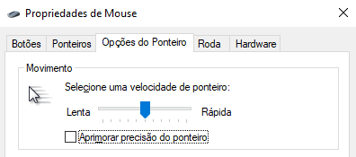
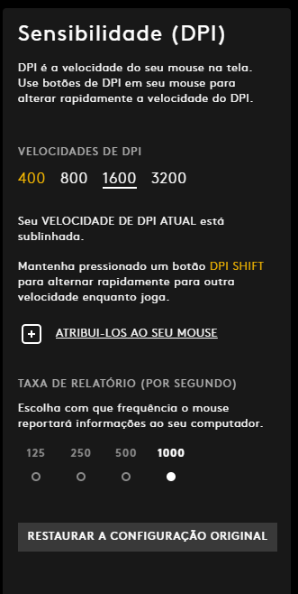

# cyberhunter-config
Basic Cyber Hunter config to improve graphics, FPS and mouse movement.

## Copy config files
Copy [config.ini](config.ini) and [neox.xml](neox.xml) to Cyber Hunter's directory.

## Unset pointer precision
Go to Control Panel / Mouse / Pointer Options and unset "Improve pointer precision".

## Setting DPI and mouse hertz
Open your mouse's software and set DPI to 1600 and frequency (hertz) to 1000hz.

## Controls
- **Skill 1**: Q
- **Skill 2**: T
- **Skill 3**: F1
- **Weapon Skill**: P or Mouse 3

## License
[MIT](LICENSE)
